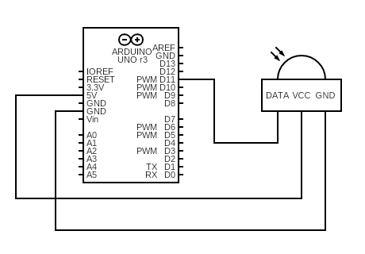

# ir-pc
📺 Control your PC using an Arduino and an IR remote — turn your old TV into a DIY smart TV!

*Note: I did this fun DIY project while I was still a newbie, so it's far from perfect, but it works!*


## 📜 Introduction

At the end of this tutorial. You'll be able to remotely control a PC using an IR-remote. I used it to build a kind of smart TV by linking a PC to an old TV. You can easily perform actions such as opening Youtube or Netflix on a certain button press, or controling the mouse using the remote arrows.


## ⚙️ Components

For this tutorial, you'll only need:
- An Arduino, for example a UNO or NANO, whichever one will work
- A generic IR receiver, like this [one](https://www.banggood.com/fr/KY-022-Infrared-IR-Sensor-Receiver-Module-p-2008806.html?cur_warehouse=CN&rmmds=search)
- A PC with Python installed
- Any IR-remote you can find at home


## 📡 Step 1: Decode your IR-remote

The first step will be to decode your IR-remote. For this, we'll use [IRremote](https://docs.arduino.cc/libraries/irremote/) arduino library.

It supports almost any kind of protocols: *Denon / Sharp, JVC, LG / LG2, NEC / Onkyo / Apple, Panasonic / Kaseikyo, RC5, RC6, Samsung, Sony, (Pronto), BangOlufsen, BoseWave, Lego, Whynter, FAST, MagiQuest, Universal Pulse Distance and Pulse Width*.

1. Connect the IR-receiver to to the Arduino. **Follow your IR-module documentation for the pinout**, but most of generic modules are cabled like mine:

    
    - DATA/OUT to pin 11 of Arduino
    - GND to GND pin of Arduino
    - VCC with 5V pin of Arduino

2. Upload [ir-decoder.ino](./ir-decoder.ino) to your Arduino and run the serial monitor.

3. Take your remote and press the buttons, it will print an hexadecimal code for each button pressed.

4. Note down the code corresponding to each button.


## ➰ Step 2: Send the received commands from the Arduino to the PC

Now that you have your hexa codes, you'll be able to send the associated commands to the PC using the serial port. To do so, you can use [ir-receiver.ino](./ir-receiver.ino) and map your hexadecimal codes with their assiociated commands!

*Note: For the `msg` string, you can enter whaterver you want as long as it is in lane with what is inside [ir-execute-cmd.py](./ir-execute-cmd.py).*


## 🎯 Step 3: Execute actions on the PC according to the commands received

This is the final step! Here, we use a Python script that receive commands from the serial port and execute actions on the PC using [PyAutoGUI](https://pypi.org/project/PyAutoGUI/) library.

### Firstly, setup a virtual environment

Make sure Python is installed on your system.

- Create and activate a virtual environment:
```bash
python -m venv .venv

# On windows
.venv\Scripts\activate

# On Linux/macOS
source .venv/bin/activate
```

- Install the dependencies:
```bash
pip install pyautogui
pip install pyserial
```


### Secondly, complete and execute the Python script

Fill `serial_port` with your actual serial port:
- On **Linux**: you can execute the command `ls /dev/tty*`. It is often `/dev/ttyUSB0` or `/dev/ttyACM0`.
- On **Windows**: open the Device Manager -> Ports (COM & LPT). You'll see something like "Arduino UNO (COM3).

Now, the goal is to execute actions according the the command received. You can use [ir-execute-cmd.py](./ir-execute-cmd.py) as an example.

You can find the full PyAutoGUI documentation [here](https://pyautogui.readthedocs.io/en/latest/), but here are the main features I used:
- `pyautogui.press('<key>')`: press the keyboard key
- `pyautogui.hotkey('<key>','<key>')`: press the specified hotkeys, useful for doing ALT + TAB for example
- `pyautogui.moveTo(x, y, delay)`: move the mouse to the specified `x` and `y` in `delay` seconds
- `pyautogui.click()`: left click on the mouse
- `pyautogui.scroll(i)`: scroll the mouse of `i` amount, positive = up, negative = down


## 👏 BRAVO 👏

Once you completed the Python file according to your needs, you can control your PC using an IR-remote!

That's it! Connect your PC to a TV and you now have a smart TV!
